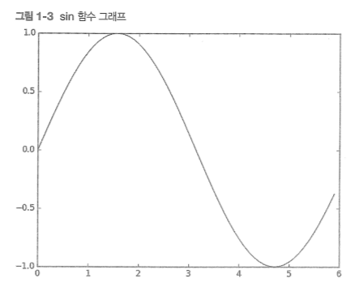
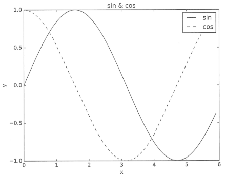
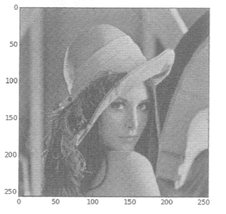

# Get started with 파이썬

## 파이썬 설치

- 파이썬3.x
- 아나콘다 배포판3

## 설치할 라이브러리

- Numpy
- matplotlib

## 설치 후 확인

```python
python --version
```

## 산술연산

```python
1 - 2
# -1
4 * 5
# 20
7 / 5
# 1.4 (float)
3 ** 2
# 9
```

## 자료형 (data type)

- 데이터의 성질

```python
type(10)
# <class 'int'>
```

## 변수

```python
x = 10 # assign
print(x)
# 10
```

- 파이썬은 동적 언어
    - 상황에 맞게 자료형을 결정

## 리스트

```python
a = [1, 2, 3]
len(a) #3
a[0] #1

## 슬라이싱
a[0:2] # index 0부터 시작해 index 2 전까지
a[1:] # index 1부터 끝까지
a[:3] # index 3 전까지
a[:-1] # 처음부터 마지막 원소 1개 앞까지. 1, 2
```

## 딕셔너리

- key - value

```python
a = {'key': value}
a['key'] = value
```

## bool

```python
a = True, b = False
not a # False
a and b # False
a or b # True
```

## if문

- indent로 scope를 정함
- space vs tab
    - space 4를 권장

```python
if a == b:
	print('same')
else:
	print('not the same')
```

## for문

```python
for i in [1,2,3]:
	print(i)

for i in range(a):
	print(i)

# casting 할 경우
b = [int(i) for i in range(a)]
```

## 함수

```python
def hello():
	print("hi")

def hello(obj):
	print("hey"+obj)
```

## 스크립트 파일

- 확장자명은 `.py`

```python
python hey.py #프로그램 실행
```

## 클래스

```python
class DeepLearning:
	def __int__(self, [args ...]):
		#생성자
		#프로퍼티

	def method1(self, [args ...]):
		# 행동
```

```python
class Dog:
	def __init__(self, sound):
		self.sound = sound
	def bark(sound):
		print(sound)

d = Dog("woof") #인스턴스 생성
d.bark()
```

## 넘파이

- ndarray = n-dimensional array
    - fixed size

```python
import numpy as np

x = np.array([1.0, 2.0]) # 배열 만들기. numpy.ndarray를 반환
print(x) # [1. 2.]
```

## 산술연산

```python
x= np.array([1.0, 2.0, 3.0])
y= np.array([1.0, 2.0, 3.0])
x + y
# 결과: array([2., 4., 6.])
```

- 두 배열의 원소 수가 같아야함
- element wise 계산

### 브로드캐스트

```python
x = np.array([1.0, 2.0, 3.0])
x / 2.0
# array([0.5, 1., 1.5])
```

## N 차원 배열

```python
A = np.array([[1,2],[3,4]])
print(A)
# [[1 2] [3 4]]
A.shape
# (2, 2) 2차 배열
A.dtype
# dtype('int64') #요소의 자료형
```

- 1차 배열 = vector
- 2차 배열 = matrix
- 벡터와 행렬의 일반화 = tensor

## 브로드캐스트


```python
A = np.array([1,2],[3,4])
B = np.array([10, 20])
A * B
# array([10, 40], [30, 80])
```

## 원소접근

```python
X = np.array([51, 55], [14, 15], [1, 2])
X[0] # array([51, 55])
X[0][1] # 55

for row in X:
	print(row)
# [51, 55]
# [14, 15]
# [1, 2]
```

```python
X = X.flatten() # 평탄화: 1차 배열로 변환
print(X)
# [51 55 14 15 1 2]
```

```python
X > 15
# array([True, True, False, False, False, False]
X[X > 15]
# array([51, 55])
```

- 동적 언어는 C나 C++같은 정적 언어보다 처리 속도가 늦음
- 파이썬은 C/C++ 로 쓰인 프로그램을 호출하는 중개자

## Matplotlib

- 그래프 라이브러리

## 그래프 그리기

- pyplot

```python
import numpy as np
import matplotlib.pyplot as plt

x = np.arrange(0, 6, 0.1) #0부터 6까지 0.1 간격으로 생성
y = np.sin(x) # sin 함수

plt.plot(x,y)
plt.show()
```



## pyplot의 기능

```python
import numpy as np
import matplotlib.pyplot as plt

x = np.arrange(0, 6, 0.1)
y1 = np.sin(x)
y2 = np.cos(x)

plt.plot(x, y1, label="sin")
plt.plot(x, y2, linestyle="--", label="cos") #점선
plt.xlabel("x")
plt.ylabel("y")
plt.title("sin & cos")
plt.legend()
plt.show()
```



## 이미지 표시

```python
import matplotlib.pyplot as plt
from matplotlib.image import imread

img = imread('pic.png') # relative path?

plt.imshow(img)
plt.show()
```

