# 퍼셉트론 Perceptron

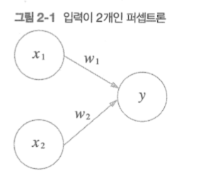

- 신경망의 기원이 되는 알고리즘
- 다수의 신호를 받아 하나의 신호를 출력
- 1 = 신호가 흐름
- 0 = 신호가 흐르지 않음
- 그림에서 x는 입력 신호
    - y는 출력 신호
    - w는 가중치 (weight)
    - 원 = 뉴런, 노드

        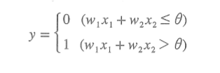

    - wx 뉴런에서 보낸 신호
    - 그 합이 임계값(theta)보다 크면 1을 출력
    - 가중치가 클수록 중요한 신호

# 논리 회로

## AND 게이트 진리표

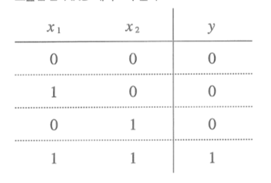

- 둘 다 1이어야 1을 반환

## NAND

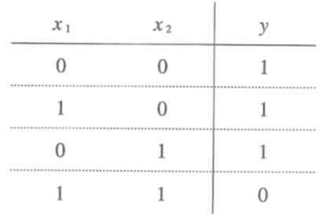

- 둘 다 1이면 0
- And의 반전

## OR

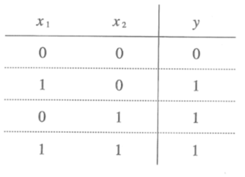

- 하나라도 1이면 1

# 퍼셉트론 구현

## AND 구현

```python
def AND(x1, x2):
    w1, w2, theta = =0.5, 0.5, 0.7
    tmp = w1 * x1 + w2 * x2
    if tmp <= theta:
        return 0
    elif tmp > theta:
        return 1
```

### 편향 bias

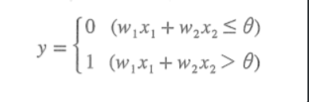

- 이 공식에서 theta = -b 일 때,

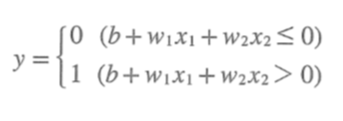

```python
import numpy as np

x = np.array([0,1])
y = np.array([0.5, 0.5])
b = -0.7
w * x

np.sum(x * w) # 0.5
np.sum(x * w) + b # -0.19999999 -> -0.2 (1dp)
```

## AND 구현 with bias

```python
import numpy as np
def AND(x1, x2):
    x = np.array([x1, x2])
    w = np.array([0.5, 0.5])
    b = -0.7

    tmp = np.sum(w * x) + b
    if tmp <= 0:
        return 0
    else:
        return 1
```

- 편향 ≠ 가중치
    - 가중치는 입력 신호가 결과에 주는 영향력
    - 편향은 뉴런(노드)이 얼마나 쉽게 활성화 (1을 출력)하는가
        - 민감성?

## NAND 구현

```python
import numpy as np

def NAND(x1, x2):
    x = np.array([x1, x2])
    w = np.array([-0.5, -0.5]) #AND 가중치의 반전
    b = 0.7

    tmp = np.sum(w * x) + b
    if tmp <= 0:
        return 0
    else:
        return 1
```

## OR 구현

```python
import numpy as np

def OR(x1, x2):
    x = np.array([x1, x2])
    w = np.array([0.5, 0.5])
    b = -0.2

    tmp = np.sum(w * x) + b
    if tmp <= 0:
        return 0
    else:
        return 1
```

# XOR

- 배타적 논리합

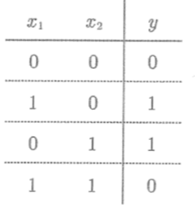

- 두 값이 달라야 1 출력

## 퍼셉트론의 시각화

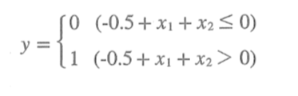

### OR인 경우

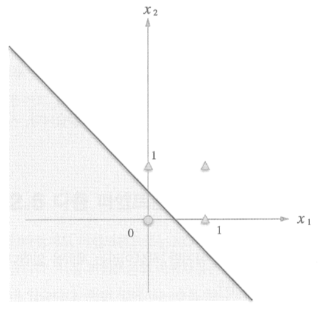

- 색이 칠해진 부분이 0을 출력
- OR 게이트는 어느 하나라도 1이면 1을 출력
    - 0을 원, 1을 세모라고 표시

### XOR인 경우

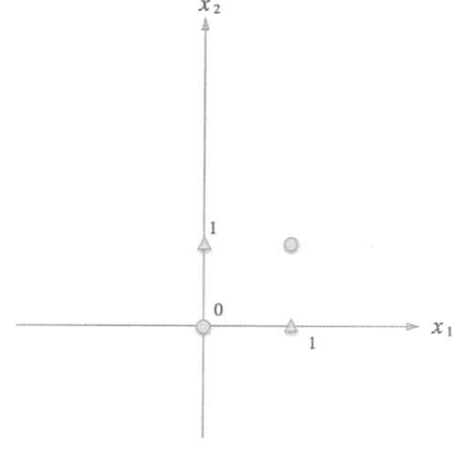

- 직선 하나로 나누기 불가능
- 직선이 아닌 곡선으로 표현해야함
- 비선형 (non-linear) vs 선형 (linear)
- 기존 퍼셉트론의 한계

# 다층 퍼셉트론

- multi layer

## XOR 구현

- 기존 게이트를 조합

    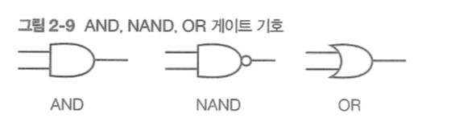

    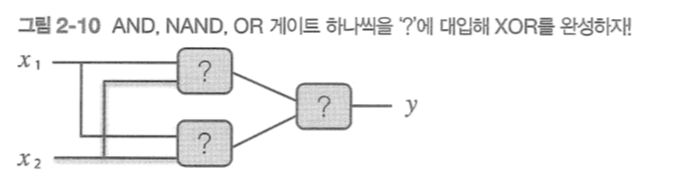

    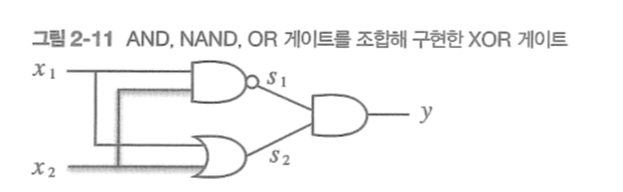

    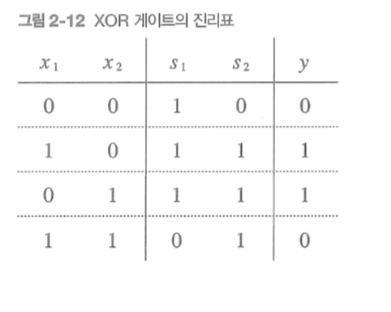

    ```python
    import numpy as np

    def XOR(x1, x2):
        s1 = NAND(x1, x2)
        s2 = OR(x1, x2)
        y = AND(s1, s2)
        return y
    ```

    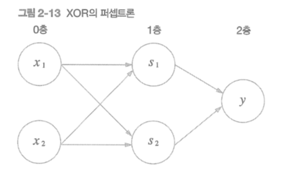

    - 0층과 1층에서 신호 전달
    - 1층과 2층에서 신호 전달
    - 2층에서 y 출력

    # NAND의 조합

    - The Elements of Computing Systems: Building a Modern Computing from First Principles
        - 테트리스
    - 이론상 2층 퍼셉트론이면 컴퓨터를 만들 수 있음
        - 비선형 시그모이드 함수를 활성화 함수로 이용하면 임의의 함수를 표현 가능 (3장에서 계속)