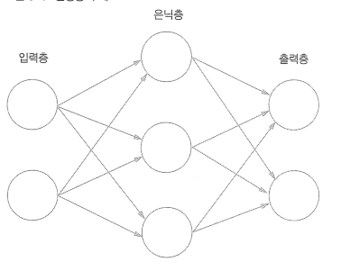

# 신경망

## 퍼셉트론 ➡ 신경망

### 신경망의 예



- 은닉층
    - 사람의 눈에 보이지 않음
- 가중치를 갖는 층은 2개뿐
    - 2층 신경망 (3층 아님)

### 퍼셉트론 복습

.png)

.png)

- b는 편향(bias) → 뉴런이 얼마나 쉽게 활성화되느냐
- w는 가중치(weight) → 각 신호의 영향력

.png)

- 입력이 0을 넘으면 1 출력
    - 아니면 0을 출력
- 계단함수 (step function)

## 활성화 함수

.png)
.png)

- activation function
- 입력 신호의 총합을 출력 신호로 변환하는 함수 h(x)
- 계단 함수

### 시그모이드 함수

.png)

- sigmoid function
- exp = 자연상수 2.7182...
- 신경망에서는 활성화 함수로 시그모이드 함수를 이용하여 신호를 변환. 변환된 신호를 다음 뉴런에 전달

### 계단 함수

```python
def step_function(x):
   #x는 실수
    if x > 0:
        return 1
    else
        return 0
```

```python
def step_function(x):
    y = x >0 
    return y.astype(np.int) # 넘파이 배열 사용시 boolean을 integer로 변환해줌
```

### 계단 함수 그래프

```python
import numpy as numpy
import matplotlib.pylab as plt

def step_function(x):
    return np.array(x > 0, dtype=np.int)

x = np.arange(-5.0, 5.0, 0.1) #범위와 0.1간격
y = step_function(x)

plt.plot(x,y)
plt.ylim(-0.1, 1.1) #y축 범위 지정
plt.show()
```

.png)

### 시그모이드 함수 구현

```python
import numpy as numpy
import matplotlib.pylab as plt

def sigmoid(x): #x가 넘파이 배열이어도 casting 필요 없음. 브로드캐스트
    return 1 / (1 + np.exp(-x))

x = np.arange(-5.0, 5.0, 0.1) #범위와 0.1간격
y = sigmoid(x)

plt.plot(x,y)
plt.ylim(-0.1, 1.1) #y축 범위 지정
plt.show()
```

.png)

### 시그모이드 함수 vs 계단 함수

.png)

- 시그모이드 함수
    - 부드러운 곡선. 연속적 그래프 continuous
    - 0,1 이 아닌 실수
- 공통점: 비성형 함수

### ReLU 함수

- rectified linear unit
- 입력이 0 이상이면 그대로 출력. 0 이하면 0을 출력

.png)

.png)

```python
def relu(x):
    return np.maximum(0,x)
```

## 다차원 배열의 계산

- 차원 확인은 np.ndim()

### 행렬의 내적 (행렬 곱)

.png)

- np.dot()으로 계산
- 차원의 원소 수가 같아야함

.png)

.png)

### 신경망의 내적

.png)

```python
X = np.array([1,2])
X.shape # (2, )

W = np.array([[1,3,5],[2,4,6]])
print(W)

W.shape

Y = np.dot(X, W)
print(Y)
```

## 3층 신경망

.png)
.png)

### 각 층의 신호 전달 구현

.png)
.png)

- 간소화
    .png)

.png)

```python
X = np.array([1.0, 0.5])

W1 = np.array([[0.1,0.3,0.5],[0.2,0.4,0.6]])

B1 = np.array([0.1, 0.2, 0.3])

print(W1.shape) #(2,3)
print(X.shape) #(2, )
print(B1.shaep) #(3, )

A1 = np.dot(X, W1) + B1
```

.png)

```python
X = np.array([1.0, 0.5])

W1 = np.array([[0.1,0.3,0.5],[0.2,0.4,0.6]])

B1 = np.array([0.1, 0.2, 0.3])

print(W1.shape) #(2,3)
print(X.shape) #(2, )
print(B1.shaep) #(3, )

A1 = np.dot(X, W1) + B1

Z1 = sigmoid(A1)

print(A1) # [0.3, 0.7, 1.1]
print(Z1) # [0.57444252, 0.66818777, 0.75026011]
```

.png)

```python
W2 = np.array([0.1, 0.4], [0.2, 0.5], [0.3, 0.6])
B2 = np.array([0.1, 0.2])

print(Z1.shape) #(3, )
print(W2.shape) #(3, 2)
print(B2.shape) #(2, )

A2 = np.dot(Z1, W2) + B2
Z2 = sigmoid(A2)
```

.png)

```python
def identity_function(x):
    return x
    
W3 = np.array([0.1, 0.3], [0.2, 0.4])
B3 = np.array([0.1, 0.2])

A3 = np.dot(Z2, W3) + B3
Y = identity_function(A3) #항등 함수
```

### 구현정리

```python
def init_network():
    network = {}
    network['W1'] = np.array([0.1, 0.3, 0.5], [0.2, 0.4, 0.6])
    network['b1'] = np.array([0.1, 0.2, 0.3])
    network['W2'] = np.array([0.1, 0.4], [0.2, 0.5], [0.3, 0.6])
    network['b2'] = np.array([0.1, 0.2])
    network['W3'] = np.array([0.1, 0.3], [0.2, 0.4])
    network['b3'] = np.array([0.1, 0.2])

    return network

def forward(network, x):
    W1, W2, W3 = network['W1'], network['W2'], network['W3']
    b1, b2, b3 = network['b1'], network['b2'], network['b3']

    a1 = np.dot(x, W1) + b1
    z1 = sigmoid(a1)
    a2 = np.dot(z1, W2) + b2
    z2 = sigmoid(a2)
    a3 = np.dot(z2, W3) + b3
    y = identity_function(a3)

    return y

network = init_network()
x = np.array([1.0, 0.5])
y = forward(network, x)
print(y)
```

### 출력층 설계

- 분류 vs 회귀
- 분류에서 소프트맥스 함수 사용

.png)
.png)

```python
def softmax(a):
    exp_a = np.exp(a)
    sum_exp_a = np.sum(exp_a)
    y = exp_a / sum_exp_a

    return y
```

### 구현시 주의점

- 오버플로우 문제
- 문제 해결

.png)

```python
def softmax(a):
    c = np.max(a)
    exp_a = np.exp(a - c)
    sum_exp_a = np.sum(exp_a)
    y = exp_a / sum_exp_a

    return y
```

### 소프트맥스 함수의 특징

- 0에서 1.0 사이의 실수를 출력
- 함수 출력의 총합은 1
- 확률적
- 추론단계에서 출력층의 소프트맥스 함수 생략해도됨
    - 출력이 가장 큰 뉴런의 위치는 그대로
- 학습단계에서는 사용

### 출력층의 뉴런 수

.png)

- 색이 가장 짙은 것이 가장 큰 출력값

## 손글씨 숫자 인식

- 순전파 (forward propagation) 과정
    - 추론 과정

### MNIST 데이터셋

.png)

```python
import sys, os
sys.path.append(os.pardir) #부모 디렉토리의 파일을 가져올 수 있도록
from dataset.mnist import load_mnist
import numpy as np
from PIL import Image

def img_show(img):
    pil_img = Image.fromarray(np.uint8(img)) #PIL용 데이터 객체로 변환
    pil_img.show()

(x_train, t_train), (x_test, t_test) = load_mnist(flatten=True, normalize=False) #0.0-0.1 사이의 값으로 정규화. flatten하면 1차원 배열
# one hot label은 one hot encoding 설정. 0과 1로 이루어진 배열. 1은 정답. 0은 아님.

#pickle -> 런타임 시 특정 객체를 파일로 저장

img = x_train[0]
label = t_train[0]

print(label)

print(img.shape)
img = img.reshape(28, 28) #원래 크기 28x28
print(img.shape)

img_show(img)
```

### 신경망의 추론 처리

- 입력층 뉴런 784 = 28 * 28 개
- 출력층 뉴런 10 = 0~9 숫자

```python
def get_data():
    (x_train, t_train), (x_test, t_test) = load_mnist(flatten=True, normalize=False, one_hot_label=False) #0.0-0.1 사이의 값으로 정규화. flatten하면 1차원 배열
# one hot label은 one hot encoding 설정. 0과 1로 이루어진 배열. 1은 정답. 0은 아님.

#pickle -> 런타임 시 특정 객체를 파일로 저장

def init_network():
    with open("sample_weight.pkl", 'rb') as f:
        network = pickle.load(f) # 학습된 가중치 매개변수 읽기

    return network

def predict(network, x):
    W1, W2, W3 = network['W1'], network['W2'], network['W3']
    b1, b2, b3 = network['b1'], network['b2'], network['b3']

    a1 = np.dot(x, W1) + b1
    z1 = sigmoid(a1)
    a2 = np.dot(z1, W2) + b2
    z2 = sigmoid(a2)
    a3 = np.dot(z2, W3) + b3
    y = identity_function(a3)

    return y
```

- 정확도 평가

```python
x, t = get_data()
network = init_network()

accuracy_cnt = 0

for i in range(len(x)):
    y = predict(network, x[i])
    p = np.argmax(x) #확률이 가장 높은 원소의 인덱스
    if p == t[i]:
        accuracy_cnt += 1

print("Accuracy: "+ str(float(accuracy_cnt)/len(X)))
```

### 배치처리

- 묶음 처리

.png)
.png)

- 이미지 1장당 처리 시간을 줄여줌
- io based가 아닌 cpu based

```python
x, t = get_data()
network = init_network()

batch_size = 100
accuracy_cnt = 0

for i in range(0, len(x), batch_size): #start, end, step
    x_batch = x[i:i+batch_size]
    y_batch = predict(network, x_batch)

    p = np.argmax(y_batch, axis=1) #확률이 가장 높은 원소의 인덱스, 1번째 차원을 축으로
    accuracy_cnt += np.sum(p == t[i:i+batch_size])

print("Accuracy: "+ str(float(accuracy_cnt)/len(X)))
```